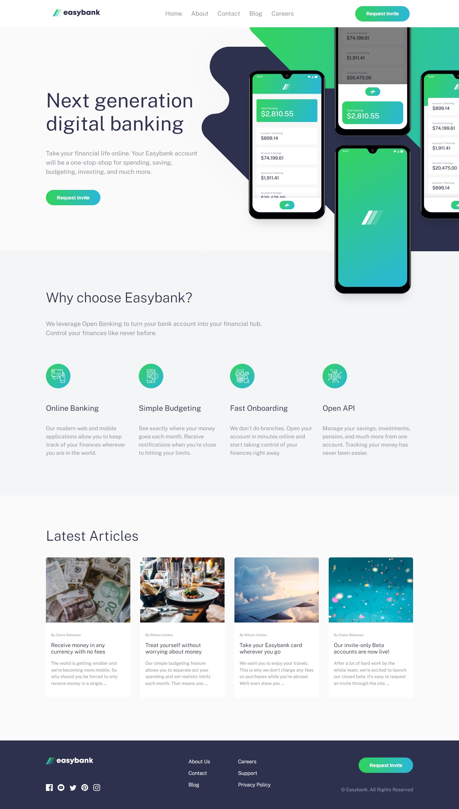
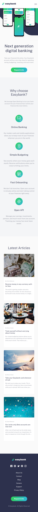

Easybank landing page

This is a solution to the [Easybank landing page challenge on Frontend Mentor](https://www.frontendmentor.io/challenges/easybank-landing-page-WaUhkoDN). Frontend Mentor challenges help you improve your coding skills by building realistic projects. In this case I added some animations that are activate by the scroll event when the elements reach a trigger point of 100 in the window. 

## Table of contents

- [Overview](#overview)
  - [The challenge](#the-challenge)
  - [Screenshot](#screenshot)
  - [Links](#links)
- [My process](#my-process)
  - [Built with](#built-with)
  - [What I learned](#what-i-learned)
  - [Useful resources](#useful-resources)
- [Author](#author)

## Overview

### The challenge

Users should be able to:

- View the optimal layout for the site depending on their device's screen size
- See hover states for all interactive elements on the page

### Screenshot
Desktop view: (1366px)

Mobile view: (375px)

You can see all the animations, hover effects and the accordeon type menu for the mobile view on the link of the live site url. The SASS file was use to make a visual grid for the elements of the page, this makes it more maintanable, separating the position, displays, margins, paddings from the more style properties of CSS like color, background, transitions, animations, fonts.

### Links
- Solution URL: [Solution Frontendmentor](https://www.frontendmentor.io/solutions/easybank-landing-page-with-html-css-sass-and-javascript-w2qPgELcj)
- Live Site URL: [Live site GitHub](https://gustcodetheone.github.io/easybankLandingPage/)

## My process

### Built with

- Semantic HTML5 markup
- CSS custom properties
- Flexbox
- Mobile-first workflow
- SASS Pre processor
- Vanilla JavaScript

### Useful resources

- [CSS Gradient Generator](https://cssgradient.io/) - This helped me for the color gradients of the button background.
- [Creating Web Animations Bringing Your UIs to Life - Book](https://www.amazon.es/dp/B06XRMMG64/ref=dp-kindle-redirect?_encoding=UTF8&btkr=1) - In chapter 11 there's a good example of how to apply a Scroll-Activated Animations.

## Author

- GitHub Profile - [gustCodeTheOne](https://github.com/gustCodeTheOne/)
- Frontend Mentor - [@gustCodeTheOne](https://www.frontendmentor.io/profile/gustCodeTheOne)
